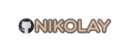

<h1 align="center"> Hi there , I'm  </h1>
 

  

## Skills 📖

### Languages ⌨️

### Preprocessors 📋

### Libraries 🗃

### Frameworks 📚

### Tools ⚙️

### OS 🖥

## About me 👨‍💻

### ❓ Who are you?

💬 My name is Nikolay, I am a self-taught frontend developer from Russia

### ❓ What is your activity?

💬 Development of browser applications

### ❓ What are you interested in?

💬 Browser-based 3D graphics, frontend development with React and mobile development with React Native

### ❓ What kind of education do you have?

💬 I graduated from StSAU with a degree related to the hotel business

### ❓ When did you start learning frontend development?

💬 In 2019, I became interested in how websites and browser apps are created

### ❓ What were you doing at that time?

💬 Initially, I created animations using CSS, then I started writing programs and browser apps using JavaScript

### ❓ What are you currently doing?

💬 I am developing my new projects, improving my knowledge and looking for a job as a frontend developer

### ❓ How much do you like frontend development?

💬 Frontend is not just the development of browser apps, it is my hobby and something I am ready to devote my whole life to

### ❓ How can I contact you?

💬 Write me in <a href='https://telegram.me/shrmznv'> Telegram </a>

## Social networks 📧

  &nbsp;
  &nbsp;
  &nbsp;
  &nbsp;

## Stats 📊

### Codewars 🗡

